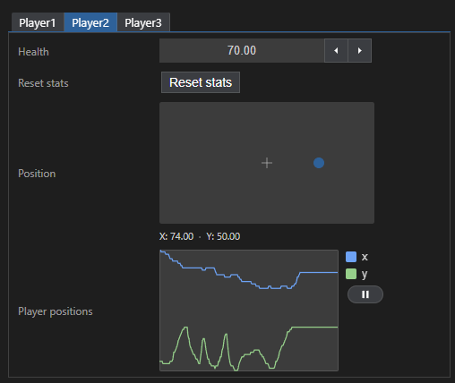
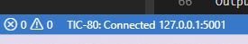
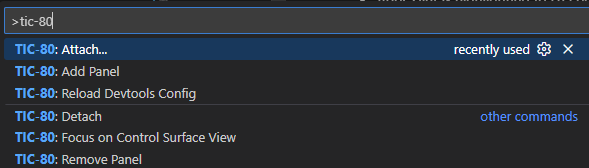
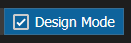
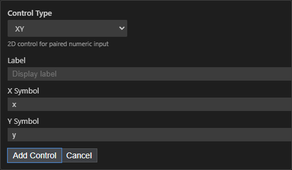
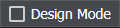
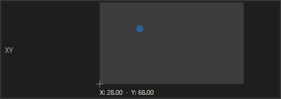
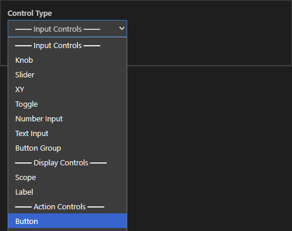

# ticbuild TIC-80 development & debugging platform extension for VS Code

This is a VS Code extension adding support for
[ticbuild](https://github.com/thenfour/ticbuild). [ticbuild](https://github.com/thenfour/ticbuild) is a build system for [TIC-80](https://tic80.com/).

This extension allows you to

## Control and monitor TIC-80 for debugging and development

Control surface, with a graphical designer, allows you to use knobs and controls to dial in
the perfect variables, and to monitor variables over time.



## Adds syntax highlighting to Lua preprocessing done by ticbuild


## Links

- [VS Code Marketplace](https://marketplace.visualstudio.com/items?itemName=TridentLoop.ticbuild-vs-code)
- [ticbuild_vscode on Github (this project)](https://github.com/thenfour/ticbuild_vscode)

### Related

- [ticbuild on Github](https://github.com/thenfour/ticbuild)
- [Somatic - web-based TIC-80 music tracker](https://somatic.tenfourmusic.net/)
- [Discord](https://discord.gg/kkf9gQfKAd)
- [TIC-80 homepage](https://tic80.com/)

This project is free, a labor of love; if you find it useful, please support by spreading the word or,

[](https://ko-fi.com/E1E71QVJ5Z)

# Usage

After installing, you should see syntax highlighting for Lua preprocessor (used by
ticbuild)

You can also attach to a running instance of TIC-80 for control surface support.
To do this, <kbd>F5</kbd> on a ticbuild project to launch the cart in watch mode.

This extension will automatically connect to the launched TIC-80 instance; you can
verify this in the status bar:



You can also manually connect to a running instance by using the command palette
(<kbd>ctrl+shift+P</kbd>):



Select `TIC-80: Attach.` and you can specify a running instance.

Select `TIC-80: Add Panel` to add a control surface.

# Control Surfaces

A ticbuild project can define a control surface for your cart. A control surface is
a set of pages, knobs, inputs, labels, for interacting with Lua variables in a TIC-80
instance. Useful for dialing in things like physics variables or positioning things
on screen.

Also useful for monitoring values or Lua expressions over time (via a scope).

## Add your first control

Let's start with an example program

```lua
x,y=50,50
str="hello"

function reset()
    x,y=0,0
    str="reset!"
end

function TIC()
  cls(14)
  print(str, x, y)
end
```

We can bind controls to any global variable in Lua. In this case, `x`,`y`, and `str`
are usable. Buttons can invoke global functions, in this case `reset()`.

### 1. Add a control surface panel by running `TIC-80: Add Panel` in the command palette.

### 2. On the new panel, click design mode to enable editing.



### 3. Click `+ Add Control` , and select the `XY` control.

Set `x` and `y` as the symbols to bind for the axes.



### 4. Click "add control"

### 5. Exit design mode to make the control usable



### 6. That's it! Animate your game by remote control.

Drag the thumb around the XY pad and you'll see the position update in the TIC-80
in real-time.



### 7. Add a button: Enter design mode, add a button control.



### 8. Set the statement to `reset()`, and click Add Control


### 9. Exit design mode, and click the new button.

You should see the text reset to position to the top-left corner `0,0`,
and the text is reset to `"reset!"` because the `reset()` function was invoked
by your button press.

### 10. Try it out-- try adding a label control to see the value of `str`.

You can also use full Lua expressions in a label, so `"Length: "..#str`
works as well.

## Pages and views

Click on the TIC-80 activity button to show a control surface in a sidebar.
Can be useful if you want a narrow control surface while you write code at the
same time.


You can also use the command palette `TIC-80: Add Panel` to add a full-page control surface.

Only one control surface is defined per project, but a control surface can
define many pages, and each view can select which page it's displaying. By default,
views show the "root" page which will show the entire control surface.

## Layout

# TIC-80 discovery mechanism

Discovery of running TIC-80 instances is described in the [TIC-80-ticbuild fork](https://github.com/thenfour/TIC-80-ticbuild/tree/main/src/ticbuild_remoting#discovery-protocol).

# `ticbuild watch` auto-attach system

When `ticbuild watch` launches the `TIC-80`, it instructs the discovery session file
to be placed in the current project directory (and not in the global location).
This allows VS Code to auto-connect when the current project is launched.

# Troubleshooting

This project is in alpha state. You might not know what's going on. Places
to check for issues:

- Output console; select the `TIC-80 Remote` output channel.
- Command palette -> Webview Developer Tools, the console may show output if there are errors
- Look in the TIC-80 itself; if Lua execution errors occur it may appear there.

# building

webview and extension are built via `scripts/devbuild.cmd`. It's primitive:
⚠️ you need to manually update the version if it changes or it will install the
wrong version.

Webview has mocked in-browser dev experience

```bash
npm run watch
```

and serve in yet another terminal:

```bash
npm run serve
```

for dev we launch in a browser, but mock the data and vscodeapi.

# Manual installation

```bash

# install
code --install-extension tridentloop.ticbuild-vs-code

# install from command line (install by file)
code --install-extension ./ticbuild-preproc-highlight-0.0.4.vsix

# uninstall
code --uninstall-extension tridentloop.ticbuild-vs-code
```

# Release history

## `v0.0.5` / `2026-02-09`

- Language extension providers, providing info about macros and other symbols across the project

## `v0.0.4` / `2026-02-05`

- Remoting and control surfaces initial support

## `v0.0.2` / `2026-01-26`

- Initial version with only syntax highlighting.
