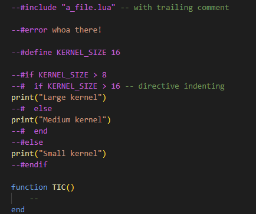

# VS Code support for TIC-80 and ticbuild

This is a VS Code extension adding support for
[ticbuild](https://github.com/thenfour/ticbuild). [ticbuild](https://github.com/thenfour/ticbuild) is a build system for
[TIC-80](https://tic80.com/).

This extension:

- Adds syntax highlighting to Lua preprocessing done by ticbuild
- Adds remote control and watch support to ticbuild's TIC-80 instances.

## Links

- [TIC-80 homepage](https://tic80.com/)
- [ticbuild on Github](https://github.com/thenfour/ticbuild)
- [ticbuild_vscode on Github (this project)](https://github.com/thenfour/ticbuild_vscode)
- [Discord](https://discord.gg/kkf9gQfKAd)
- [Somatic - web-based TIC-80 music tracker](https://somatic.tenfourmusic.net/)

This project is free, a labor of love; if you find it useful, please support by spreading the word or,

[](https://ko-fi.com/E1E71QVJ5Z)

# Installation

```bash

# install
code --install-extension tridentloop.ticbuild-vs-code

# install from command line (install by file)
code --install-extension ./ticbuild-preproc-highlight-0.0.1.vsix

# uninstall
code --uninstall-extension tridentloop.ticbuild-vs-code
```

# Usage

Upon installing & enabling this, you should see highlighting:



# Building

```bash
# create package
npx @vscode/vsce package
```

# Make certain it's really updated in case of updates/reinstall

(mostly for development)

You can use `--force` to `code --install-extension`, however most reliable is to:

- in the command palette, `Developer: Reload Window`

or more forcefully,

1. in vs code, extensions, open the page for this extension. uninstall it.
2. click on the little size (2.14kb) hyperlink; it opens the dir where it is on disk. Delete its folder.

# Instance discovery

# `ticbuild watch` auto-attach

# Outputs

Output window -> select `TIC-80 Remote` in the output channel.

# Watch treeview

In explorer view, there's a treeview pane called `TIC-80 Watches`

# building

build the webview first

```bash
cd ControlSurfaceUI
npm run build
```

then build the extension.
